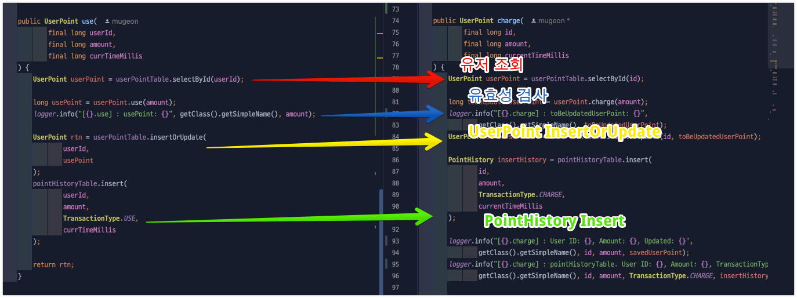

# 1주차 과제 보고서

---

## 목차
1. [테스트 코드 관심사]()
2. [TransactionType에 따른 전략패턴]()
3. [동시성 제어 기술 보고서]()


### 1. 테스트 코드 관심사 분리

- 각 Layer마다 테스트를 하고 싶은 관심사가 있고 Repository, Service Layer에서 통합, 단위 테스트를 진행을 하였다면 비즈니스 로직에 대한 검증은 끝났다고 생각합니다.

### 컨트롤러 테스트 코드

- 컨트롤러에서 테스트 코드는 단순히 Validation을 검증하는 부분이 아니고 API 명세서라고 생각합니다.
- 비즈니스를 제외하고 내 코드의 반환 값을 직관적으로 볼 수 있는 부분이고 해당 Layer에서 테스트 코드의 관심사는 요청, 결과라고 생각하여 요청을 분리하였습니다.


```java
//PointMockApiCaller
public UserPoint point(long id, int expectStatus) throws Exception {
    MockHttpServletRequestBuilder builder = get("/point/{id}", id)
            .contentType(MediaType.APPLICATION_JSON);

    return objectMapper.readValue(mockMvc.perform(builder)
            .andExpect(status().is(expectStatus))
            .andReturn().getResponse().getContentAsString(StandardCharsets.UTF_8), new TypeReference<>() {
    });
}


//PointControllerTest
@Test
@DisplayName("사용자 ID로 포인트 정보를 조회할 수 있다")
public void getPoint_shouldReturnUserPoint() throws Exception {
    // given
    UserPoint emptyPoint = UserPoint.empty(USER_ID);
    when(pointService.getUserPointWithDefault(USER_ID)).thenReturn(emptyPoint);

    // when
    UserPoint rtn = pointMockApiCaller.point(
            USER_ID,
            EXPECT_STATUS_OK
    );

    // then
    assertAll(
            () -> assertNotNull(rtn),
            () -> assertEquals(USER_ID, rtn.id()),
            () -> assertEquals(rtn.point(), 0L),
            () -> assertThat(rtn.updateMillis()).isNotNull()
    );
}

```

<br/>

---

<br/>


### 2. TransactionType에 따른 전략패턴



TransactionType에 따라서 중복적인 코드가 발생되며 이후 트랜잭션이 추가된다면 각 관심사를 분리하기 어렵기 때문에 전략 패턴을 도입했습니다.
포인트 서비스에서 TransactionType에 따라 컴포넌트를 호출하는 구조로 중복을 피하고 관심사를 분리하였습니다.

- 최종적으로 ReentrantLock과 전략패턴을 이용하여 charge, use를 타입에 따라 관리하고 동시성을 처리했습니다.
```java
public UserPoint executePointTransaction(
            final long userId,
            final long amount,
            final TransactionType transactionType,
            final long timestamp
    ) {
        PointTransaction transaction = pointTransactionFinder.findTransactionService(transactionType);

        ReentrantLock lock = userLocks.computeIfAbsent(userId,
                id -> new ReentrantLock());
        lock.lock();
        try {
            logger.info("Lock user: {}, transaction type: {}", userId, transactionType);
            return transaction.execute(userId, amount, timestamp);
        } finally {
            lock.unlock();
            logger.info("unLock user: {}", userId);
        }
    }
```

<br/>

---

<br/>


### 3. 동시성 제어 기술 보고서

#### synchronized 키워드의 한계

자바에서 synchronized 키워드는 가장 기본적인 동시성 제어 메커니즘이지만 몇 가지 한계가 있습니다:

- 모든 객체에는 각자 내부적으로 락이 있습니다. 이것을 자바에서는 `모니터락`이라고 부릅니다.
- `synchronized` 키워드를 메서드에 추가하게 된다면 접근 시 모니터락이 있어야 합니다.
- 락을 획득하지 못한 스레드는 Runnable -> Blocked 상태로 변경되어 무한정 대기하게 됩니다.
- 이러한 대기 상태를 TimeOut이나 인터럽트로 처리할 수 없다는 단점이 있습니다.
- 또한 락 획득에 있어 공정성(fairness)을 보장하지 않습니다.

#### ReentrantLock의 장점

ReentrantLock은 synchronized의 한계를 극복하기 위한 대안으로, 다음과 같은 장점이 있습니다:

1. **인터럽트 가능한 락 획득**: tryLock() 메서드로 락 획득 시도 시간을 제한할 수 있습니다.
2. **공정성 옵션**: 생성자에 true를 전달하면 가장 오래 대기한 스레드에게 우선권을 부여합니다.
3. **조건 변수**: Condition 객체를 통해 더 세밀한 스레드 제어가 가능합니다.
4. **락 정보 확인**: 현재 락 상태에 대한 정보를 얻을 수 있습니다.

#### 구현 예시

```java
public UserPoint executePointTransaction(
        final long userId,
        final long amount,
        final TransactionType transactionType,
        final long timestamp
) {
    PointTransaction transaction = pointTransactionFinder.findTransactionService(transactionType);

    ReentrantLock lock = userLocks.computeIfAbsent(userId,
            id -> new ReentrantLock());
    lock.lock();
    try {
        logger.info("Lock user: {}, transaction type: {}", userId, transactionType);
        return transaction.execute(userId, amount, timestamp);
    } finally {
        lock.unlock();
        logger.info("unLock user: {}", userId);
    }
}
```

이 구현에서는 사용자별로 ReentrantLock을 관리하여 동일 사용자에 대한 트랜잭션은 순차적으로 처리하면서도, 서로 다른 사용자에 대한 트랜잭션은 병렬로 처리할 수 있게 했습니다.

#### 동시성 테스트 방법

CountDownLatch를 사용한 테스트로 동시성 제어가 올바르게 작동하는지 검증할 수 있습니다:

```java
@Test
void concurrentTransactionsTest() throws InterruptedException {
    int threadCount = 10;
    ExecutorService executor = Executors.newFixedThreadPool(threadCount);
    CountDownLatch readyLatch = new CountDownLatch(threadCount);
    CountDownLatch startLatch = new CountDownLatch(1);
    CountDownLatch completionLatch = new CountDownLatch(threadCount);
    
    for (int i = 0; i < threadCount; i++) {
        executor.submit(() -> {
            readyLatch.countDown(); // 준비 완료
            try {
                startLatch.await(); // 시작 신호 대기
                // 트랜잭션 실행
            } finally {
                completionLatch.countDown(); // 완료 신호
            }
        });
    }
    
    readyLatch.await(); // 모든 스레드 준비 대기
    startLatch.countDown(); // 모든 스레드 동시 시작
    completionLatch.await(); // 모든 스레드 완료 대기
    
    // 결과 검증
}
```

CountDownLatch를 사용하면 여러 스레드를 정확히 동시에 시작하고, 모든 스레드의 작업이 완료될 때까지 대기할 수 있어 동시성 이슈를 효과적으로 테스트할 수 있습니다.

동시성 제어는 멀티스레드 환경에서 데이터 일관성을 유지하는 데 필수적이며, 적절한 기법을 선택하고 테스트하는 것이 중요합니다.